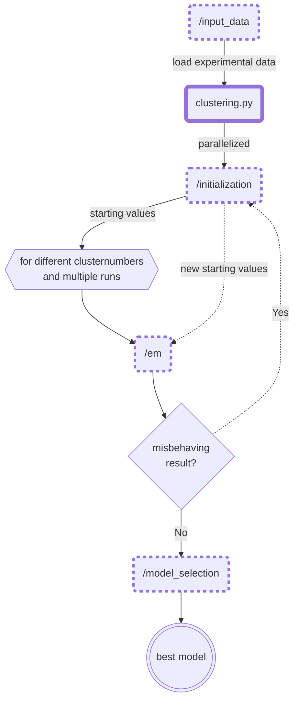

This repository depicts the current state of my undergraduated thesis. (work ongoing)

    .
    ├── ...
    ├── /clustering           # core module
    │   ├── /em                     # low-level implementation of the EM-Algorithm
    │   ├── /initialization         # starting value routines (multiple options)
    │   ├── /input_data             # simulate/load experimental data
    │   ├── /model_selection        # select best models according to specific criteria
    │   └── clustering.py           # high-level entry point for the final application
    |
    ├── /miscellanous         # uncategorized small tools used across the core module
    └── ...

**Installation** (currently not recommended): 
* clone repository
* obtain required packages via ```pip install requirements.txt``` 


## Project Overview
### Objective

The purpose of this project is to create a fully automated unsupervised learning algorithm to identify individual defects of MOSFETs from time-dependent defect spectroscopy (TDDS) data.


### Idea

The reasonable assumption, that the measurements can be modelled 
by a bivariate mixture distribution, incentivizes the use of a model-based clustering approach. After promising initial results 
the decision was made to utilize the Expectation-Maximization Algorithm (EM-Algorithm).

### Problems (to be) solved
Although the EM-Algorithm has proven itself over a wide range of application areas in the past, 
it possesses some inconveniences, which make it hard to fully automate the clustering process:

* the outcome is highly dependent on starting values
* it cannot decide on the correct number of clusters   
* outliers can distort the outcome
* isolated datapoints can lead to useless solutions in the form of mixtures with divergent likelihoods

 
### Flowchart
This flowchart (hopefully) gives you a rough idea on how the module works and how the different components relate to each other. 


    

  
## Interim results
This is the simulated input data from the `Objective` section above clustered by this module. Feel free to have a look at ```example_notebook_README.ipynb``` if you want to see how this example has been generated.

*We can see the sucessfully reconstructed cluster 0 (red) and  4 (lime green). Cluster 2 (dark green) and 5 (pink) have been merged together with their bigger neighbours 1 (violet) and 3 (teal).*


