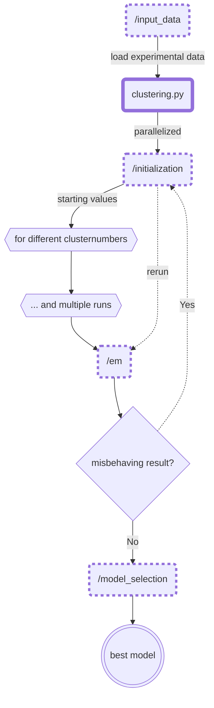

# Code
## Introduction
This repository depicts the current state of my undergraduated thesis. (work ongoing)

### Objective

The purpose of this project is to create a fully automated unsupervised learning algorithm to identify individual defects of MOSFETs from time-dependent defect spectroscopy (TDDS) data.

### Idea

The reasonable assumption, that the measurements can be modelled 
by a bivariate mixture distribution, incentivizes the use of a model-based clustering approach. After promising initial results 
the decision was made to utilize the Expectation-Maximization Algorithm (EM-Algorithm).

## Methodology

   
## Project structure  
  
    .
    ├── ...
    ├── /clustering           # core module
    │   ├── /em                     # low-level implementation of the EM-Algorithm
    │   ├── /initialization         # starting value routines (multiple options)
    │   ├── /input_data             # simulate/load experimental data
    │   ├── /model_selection        # select best models according to specific criteria
    │   └── clustering.py           # high-level entry point for the final application
    |
    ├── /miscellanous         # uncategorized small tools used across the core module
    └── ...
  
## 

